# Web 应用漏洞攻防

## 实验目的

- 了解常见 Web 漏洞训练平台；
- 了解 常见 Web 漏洞的基本原理；
- 掌握 OWASP Top 10 及常见 Web 高危漏洞的漏洞检测、漏洞利用和漏洞修复方法；

## 实验环境

- Kali 
- Juiceshop

## 实验要求

- [x] 完成不少于 **5** 种不同漏洞类型的漏洞利用练习；
- [x] （可选）使用不同于官方教程中的漏洞利用方法完成目标漏洞利用练习；
- [x] （可选）**最大化** 漏洞利用效果实验；
- [x] （可选）尝试从源代码层面修复漏洞；

## 实验准备

环境安装

已安装好webgoat的话直接执行语句`cd ../../owasp/juice-shop/ && docker-compose up -d`，即可启动JuiceShop

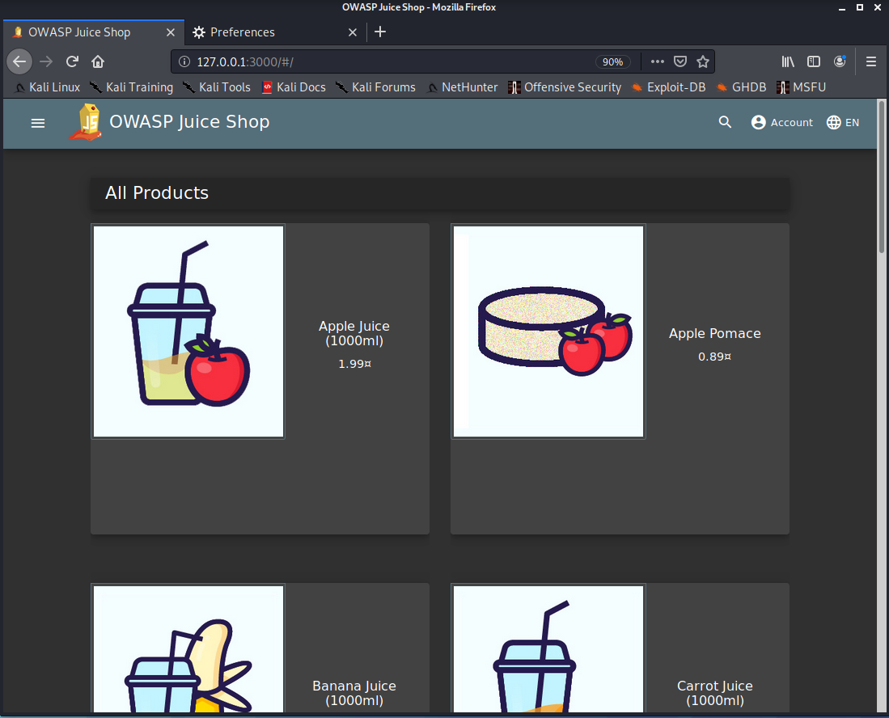

## 实验内容

### 找到计分板

+ solve：
	
	+ 因为界面没有直接的链接可以点进计分板，一开始直接猜测在url后面加/ScoreBoard，但是不对，于是在主页面利用开发者工具进行搜查，在search栏搜关键字score，可以看到score board的链接形式为`score-board`
	
	  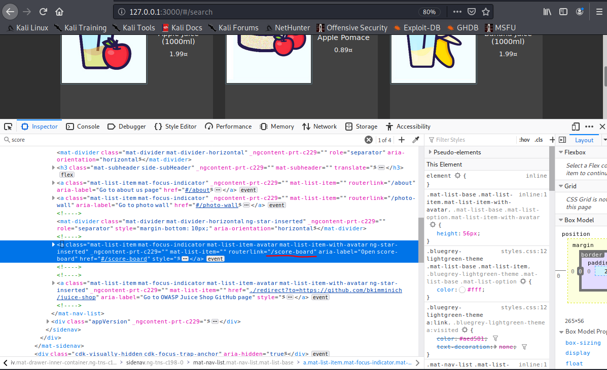
	
	  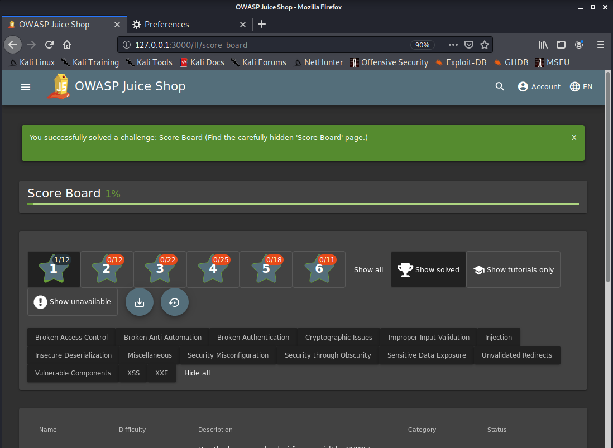

### 认证缺陷

**Bjoern's Favorite Pet**

+ goal：通过网站的忘记密码机制重置Bjoern的OWASP账号密码
+ solve：
	+ 首先在登陆页面点击忘记密码，然后输入Bjoern的邮箱地址`bjoern@owasp.org`，注意是owasp的不是juiceshop的，而且名字首字母是小写，然后发现Bjoern的验证问题是最喜欢的宠物的名字
	
	+ 这里我一开始看错了题目，以为是最喜欢的动物种类，然后用Burpsuite的intruder模块进行爆破爆不对...（所以说一定要看清题目，想起了黄老师今天上课说的“没找对方向，越努力越悲哀...”）。于是换方向，官网上提示了三个方向：在网络上可以查找到Bjoern问题的答案提示、Bjoren也可能偶然在某个场景中提到了这个答案并被拍摄下来了、用常见的宠物名进行爆破。个人觉得宠物名比较随机，爆破可能有难度，于是在网络上搜索Bojern这个人，发现YouTube和facebook上都有Björn Kimminich的账号，YouTube中有一段视频是Bjoern在演示JuiceShop用法，他在注册账号的时候刚好暴露了验证问题是“zaya”，用这个答案进行密码重置就可以了（感觉这个验证问题太简单太客观，像宠物名、地点、人名这样的问题稍微了解以下问题主人都能知道并攻击）
	
	  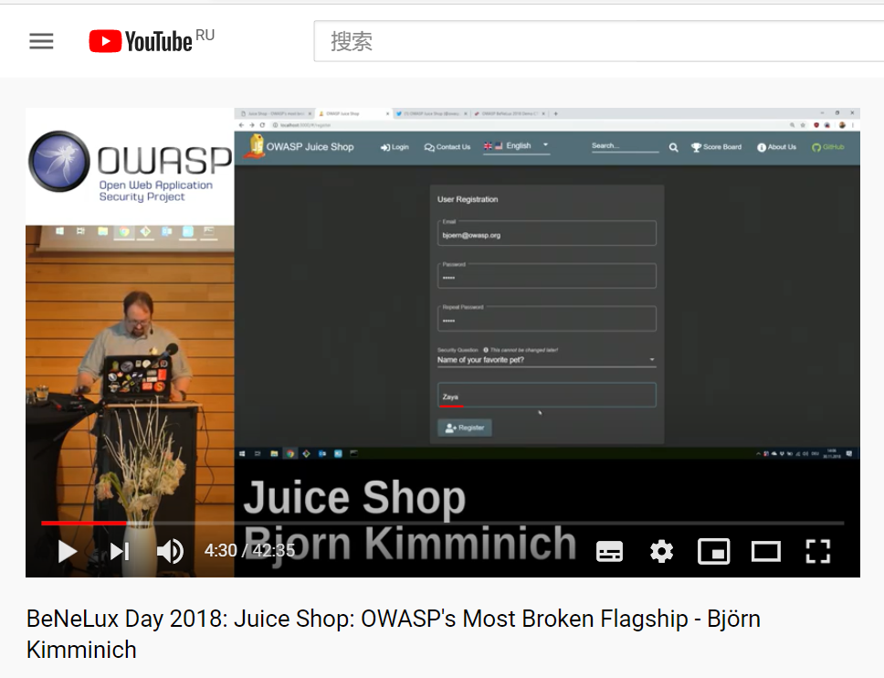

### 未验证的用户输入

先做个一星的试试看

**Retrieve the photo of Bjoern's cat in "melee combat-mode"**

+ goal：在photo-wall页面有一张无法显示的图，要求显示这张图

+ solve：

  + 先查看图片部分的页面源码，将鼠标光标放到这张图的url上时会显示“could not load this image”，说明图片链接有问题，观察发现url末尾参数中有不能被识别的猫咪图标和‘#’字符

    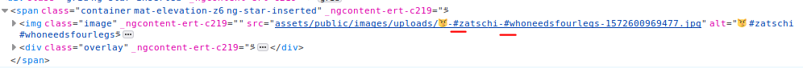

  + 因此需要将其进行URL编码才能显示(URL中出现特殊字符时一定要编码，下面的题中也会涉及到)

    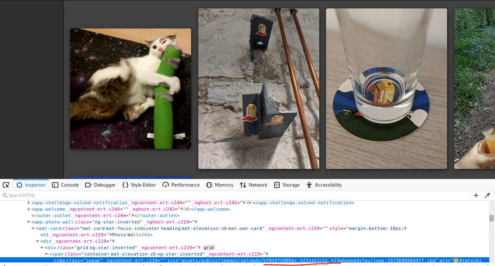

    

**Payback Time**

+ goal：下一个能让自己账户金额变多的订单

+ solve：

  + 首先在主页面随意点击一件商品加入购物车，然后抓包,可以看到有三个参数部分：商品id、购物车id、商品数量

    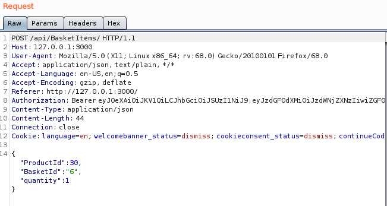

  + 购物车界面会显示totalprice，要让自己的钱变多的话可以试一下把商品数量参数改为负数，使总价为负。那么先将刚刚抓到的包中quantity参数部分改为-100，发送，但是会收到`validation error`报错的响应包

    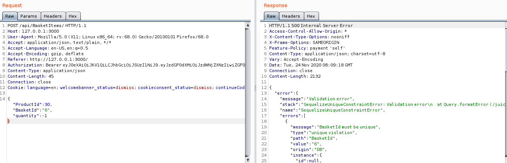

  + 为了验证该错误和负数参数无关我改成正数试了一遍，还是同样的错,所以换一个商品试试，改一下Product ID，再次发包，ok，成功强制性使商家倒贴并变rich

    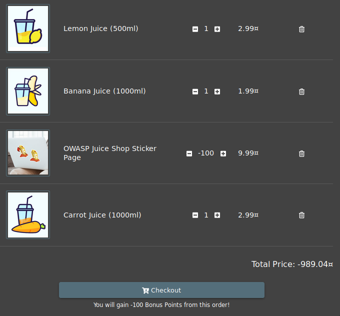

    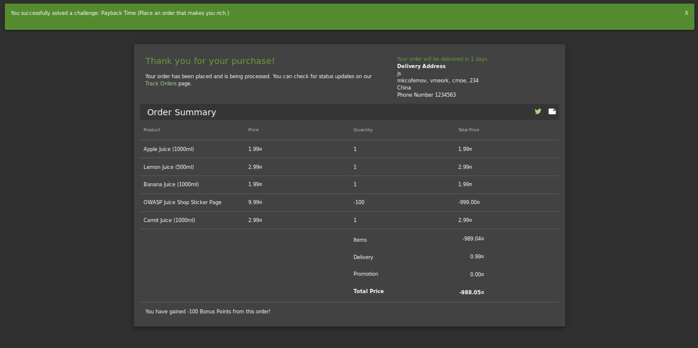

+ 实验感想：如果这是真的就好了

### 注入

#### Log in with the administrator's user account

+ goal：用管理员的账号登陆

+ solve
	+ 官方文档中说，想用管理员账号登陆有多种方法，比如说如果已知管理员的邮箱地址，可以进行密码定向攻击，或是获得管理员密码的哈希值
	
	+ 首先按照页面导航提示的在email栏输入‘符号，密码栏随意输入，突然发现完成了Error Handling 这个任务，在Burpsuite中抓包，观察响应包，可以看到错误信息，该输入引起了SQLITE_ERROR错误，因此顺便完成了Error Handling任务，并且可以知道该网站存在sql注入漏洞
	
	  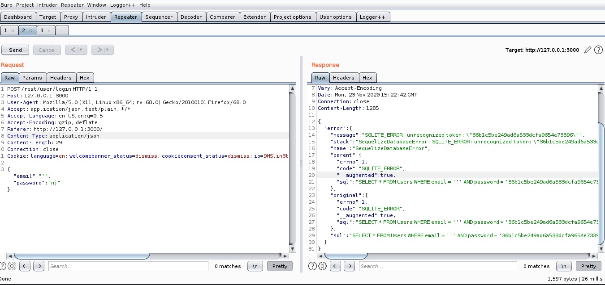
	
	+ 已经知道存在sql漏洞后，我们可以构造SQL语句来实现绕过登陆验证，首先猜测一下管理员的邮箱地址，参考上一题题目中给的邮箱地址尾缀，猜测管理员的地址为admin@juice-sh.op
	
	  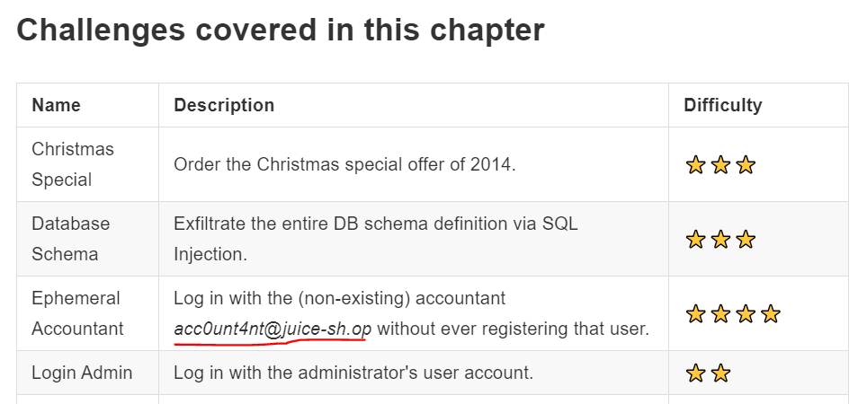
	
	+ 然后在email输入框内输入`admin@juice-sh.op'--`,密码随便填，`--`会将剩下的 SQL 部分注释掉，也就是忽略密码部分验证，点击登录发现成功完成任务
	
	  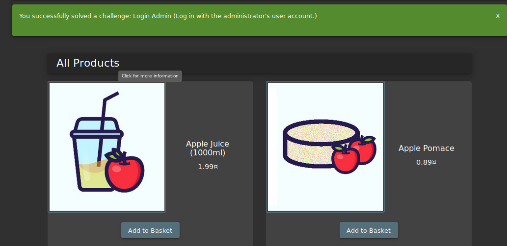
	
	+ 在burpsuite中看到响应包内有一串token，那就拿去解码看看吧~可以看到管理员的邮箱果然是这样
	
	  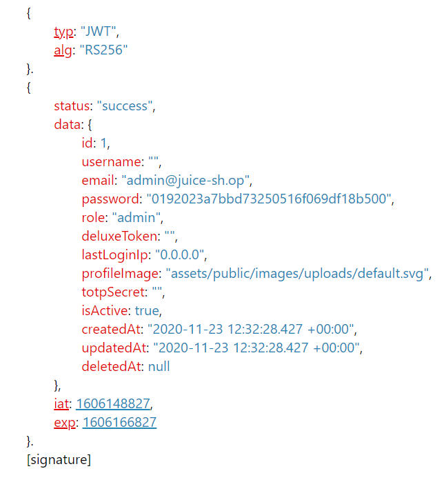
	
+ 漏洞点：网站没有对用户的输入做出筛选、过滤和验证

  

### 敏感数据暴露
**Access a salesman's forgotten backup file**

+ goal：找到售货员曾经上传的备份文件
+ solve：
	+ 一开始有点毫无头绪，看了官网题目说明`Analyze and tamper with links in the application that deliver a file directly`也没明白，疑问三连：链接是啥，上哪找，找啥...然后看了一下题解，说是在第一关的题目中会找到一个ftp目录，里面是机密文件，所以说感觉JuiceShop的题目很多是有关联的，直接跳着做可能很多细小的线索不知道。根据这个提示先进入/ftp页面，可以查看到很多机密文件
	
	  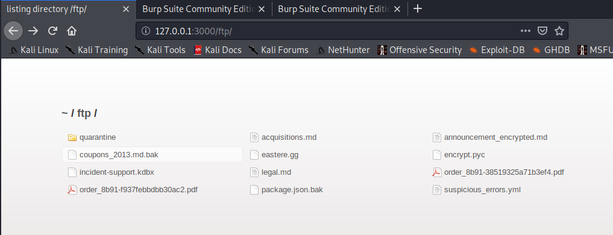
	
	+ 根据文件名猜测与售货员相关的遗忘备份文件应该是coupons_2013.md.bak,但是直接点击的话页面会提醒只能打开md和pdf文件
	
	  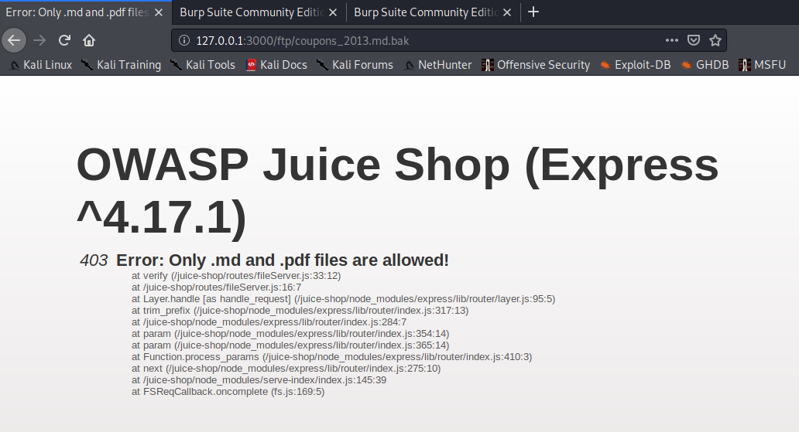
	
	+ 因此我们可以使用%00进行截断攻击，但是在url中`%`符号不会被直接识别，需要编码，所以输入%00的编码值`%2500`， 在`http://localhost/ftp/coupons_2013.md.bak`后添加`%2500.md`即可打开文件
	
	  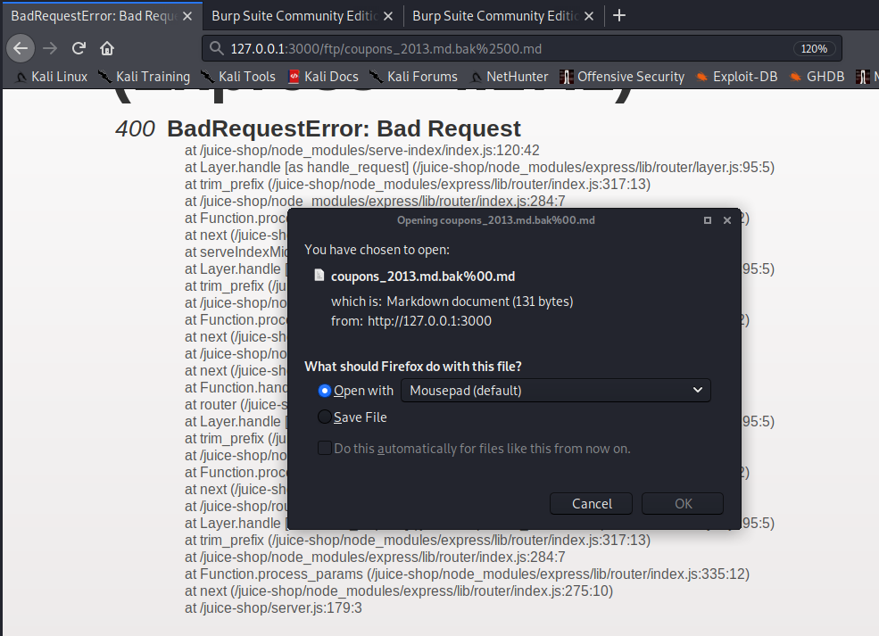
	

### 密码学相关

**Apply some advanced cryptanalysis to find the real easter egg**

+ goal：使用一些高级密码分析知识来找到复活节彩蛋
+ solve：
	+ 解决该题需要先解决` Find the hidden easter egg`这个先行题，也就是在/ftp页面中打开`eastere.gg`文件，解决方法和上一题找备份文件一样，这里就不赘述了
	
	+ 打开文件后可以看到里面有一串加密字符,在webgoat里做多了token题的话一眼就能看出这是base64编码结果，拿去解码得到`/gur/qrif/ner/fb/shaal/gurl/uvq/na/rnfgre/rtt/jvguva/gur/rnfgre/rtt`,看这个形式应该是url链接内容，但是直接放到url后的话没有任何内容，根据官网说的可能需要多层解密，因此这串内容也还是一串密文
	
	  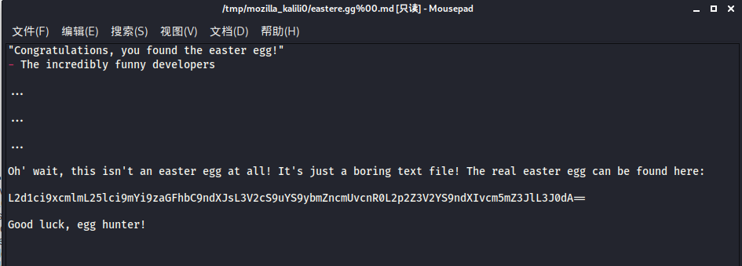
	
	+ 观察一下这串字符串，可以看到里面有重复的内容像`gur`、 `rtt` 什么的，而且都是字母，所以应该用的是比较简单的凯撒密码，突然发现这个`rtt`的结构和`egg`很像呀，然后算一下发现r和e、t和g之间的偏移位都是13，所以很明显用的应该就是ROT13加密，对其进行解密得到`/the/devs/are/so/funny/they/hid/an/easter/egg/within/the/easter/egg`
	
	+ 在网站后缀输入，成功收获复活节彩蛋一枚
	
	  
### 实验问题

+ **kali内的火狐开发者工具问题**

  在第一次找计分板的时候，用开发者工具内的search栏进行关键字查找，但是我的这个火狐搜索栏只能搜到元素名，搜不到内容

  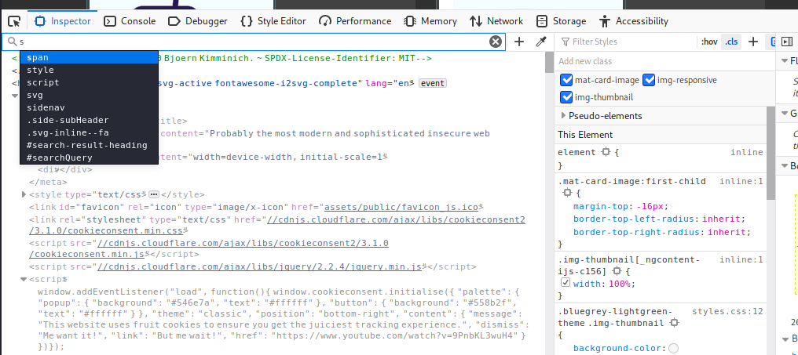

  解决办法：明天再说。因为第二天我执行同样的操作又能够搜到关键字内容了...

+ **juice-shop题目问题**

  我的juice-shop内XXS问题不知道为啥只有两道题，官网上显示有好多道的

  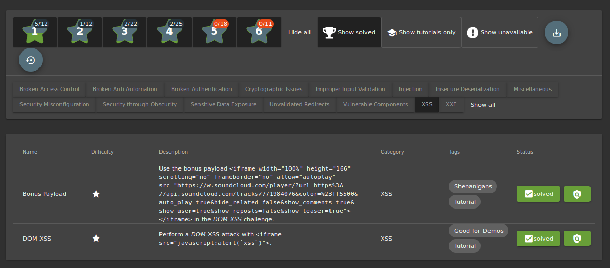

  然后就是XXE攻击为啥不能在容器内进行呢，官网上的解释没太明白...

## 实验参考

+ [juice-shop官方文档](https://bkimminich.gitbooks.io/pwning-owasp-juice-shop/content/part2/injection.html])
+ [SQL注入-JuiceShop教程](https://blog.csdn.net/heisejiuhuche/article/details/106232413)
+ [owasp官方网站](https://owasp.org/)
+ [师姐仓库](https://github.com/CUCCS/2019-NS-Public-chencwx/blob/ns_chap0x07/ns_chapter7)
