# 基于 VirtualBox 的网络攻防基础环境搭建

### 实验目的
+ 掌握 VirtualBox 虚拟机的安装与使用；
+ 掌握 VirtualBox 的虚拟网络类型和按需配置；
+ 掌握 VirtualBox 的虚拟硬盘多重加载；

### 实验环境
+ VirtualBox
+ 攻击者主机：Kali
+ 网关：Debian
+ 靶机：Windows-xp3，Kali

### 实验步骤
#### 下载各虚拟机镜像，创建虚拟机，并将虚拟硬盘配置成多重加载
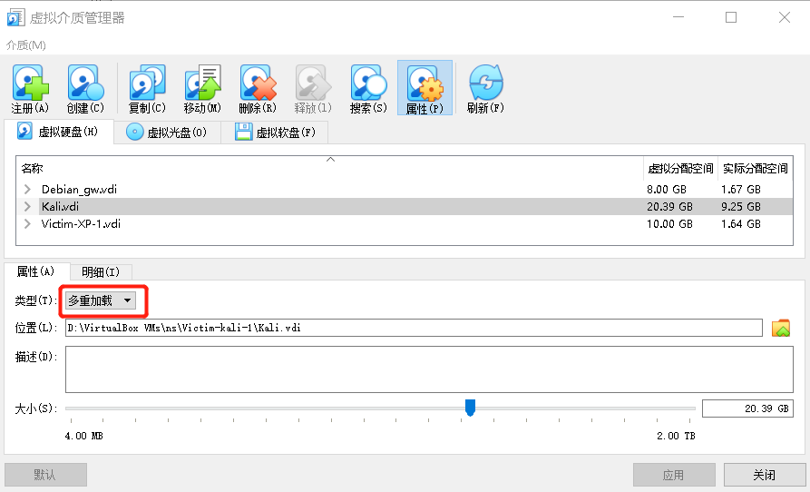
##### 为各虚拟机修改网卡连接方式
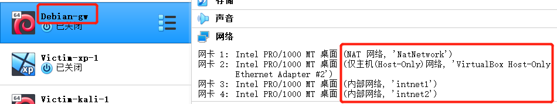
#### 配置网络
网关机
+ NAT网络、Host-Only网络以DHCP方式动态获取ip地址
+ 内网连接的两块网卡手动分配ip地址
	+ 编辑/etc/network/interfaces,增加如下内容
  
      ```
          post-up iptables -t nat -A POSTROUTING -s 192.168.20.0/24 ! -d 192.168.0.0/16 -o enp0s3 -j MASQUERADE
        post-up iptables -t nat -A POSTROUTING -s 192.168.30.0/24 ! -d 192.168.0.0/16 -o enp0s3 -j MASQUERADE

        # demo for DNAT
      
        post-up iptables -P FORWARD DROP
        post-up iptables -A FORWARD -m state --state RELATED,ESTABLISHED -j ACCEPT
        post-up iptables -A FORWARD -s '192.168.20.0/24' ! -d '192.168.0.0/16' -j ACCEPT
        post-up iptables -A FORWARD -s '192.168.30.0/24' ! -d '192.168.0.0/16' -j ACCEPT
        post-up iptables -I INPUT -s 192.168.20.0/24 -d 192.168.30.0/24 -j DROP
        post-up iptables -I INPUT -s 192.168.30.0/24 -d 192.168.20.0/24 -j DROP
        post-up echo 1 > /proc/sys/net/ipv4/ip_forward
        post-down echo 0 > /proc/sys/net/ipv4/ip_forward
        post-down iptables -t nat -F
        post-down iptables -F
    
      allow-hotplug enp0s8
      iface enp0s8 inet dhcp

      allow-hotplug enp0s9
      iface enp0s9 inet static
        address 192.168.20.1
        netmask 255.255.255.0

      allow-hotplug enp0s10
      iface enp0s10 inet static
        address 192.168.30.1
        netmask 255.255.255.0
      ```
	+ 重启网络生效  
	`systemctl restart networking`
    
+ 各网卡IP地址
   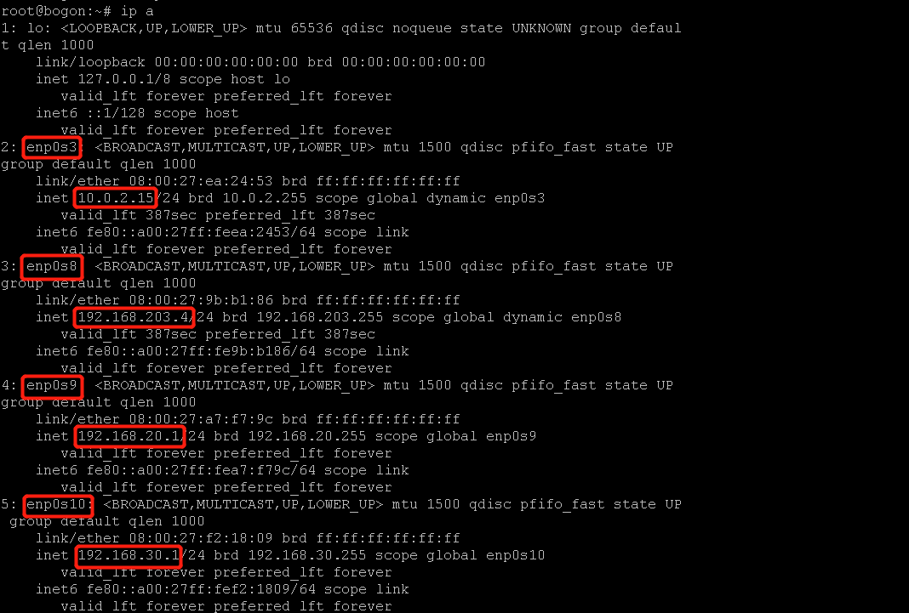
+ 安装dnsmasq服务器
	
      ```
      sudo apt-get update 
      sudo apt install dnsmasq
      ```
    + 停止dnsmasq服务   
    `/etc/init.d/dnsmasq stop`
    + 备份配置文件
      ```
      cp dnsmasq.conf dnsmasq.conf.bak
      ```
    + 编辑dnsmasq.conf配置文件
      ```
      interface=enp0s9
        listen-address=192.168.20.1
        dhcp-range=192.168.20.100,192.168.20.150,255.255.255.0,240h
        dhcp-option=3,192.168.20.1

        interface=enp0s10
        listen-address=192.168.30.1
        dhcp-range=192.168.30.100,192.168.30.150,255.255.255.0,240h
        dhcp-option=3,192.168.30.1
      ```
    + 重启服务   
    `systemctl restart dnsmasq`
    
靶机    

+ Victim-kali-1    
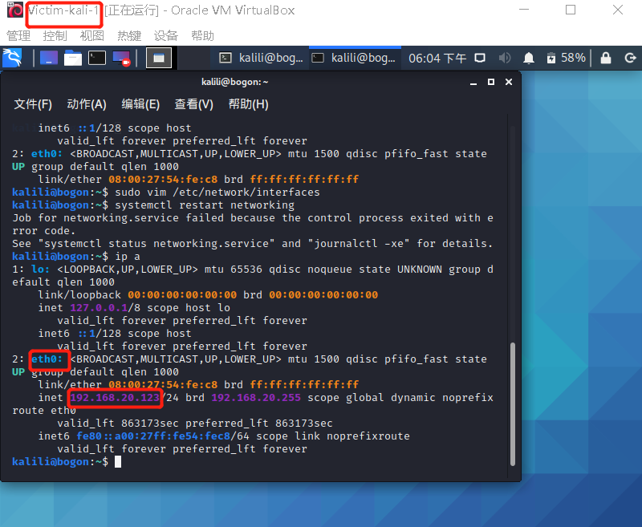
+ Victim-xp-1     
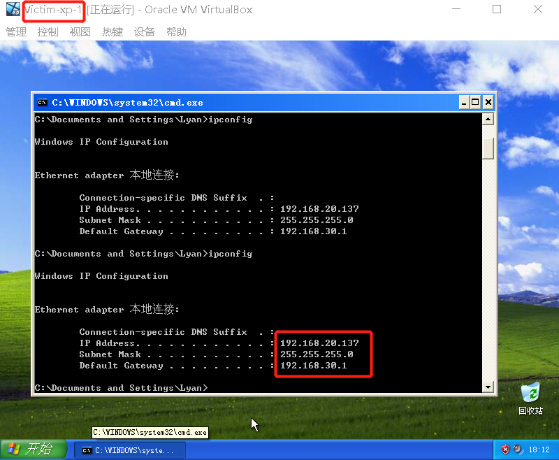
+ Victim-debian-2       
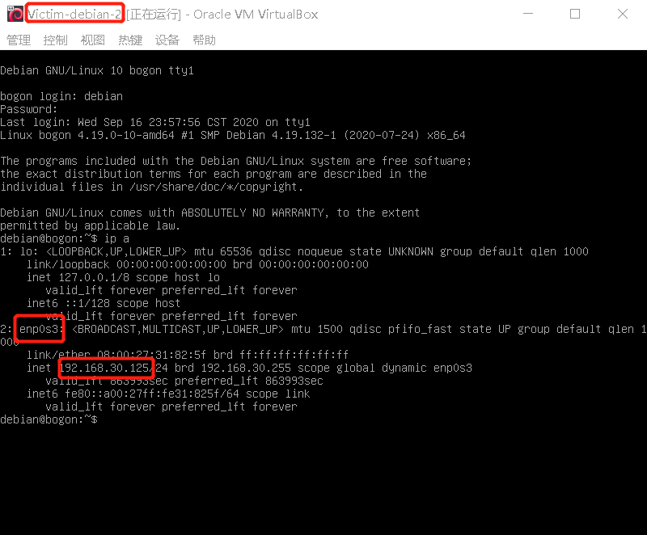     
+ Victim-xp-2      
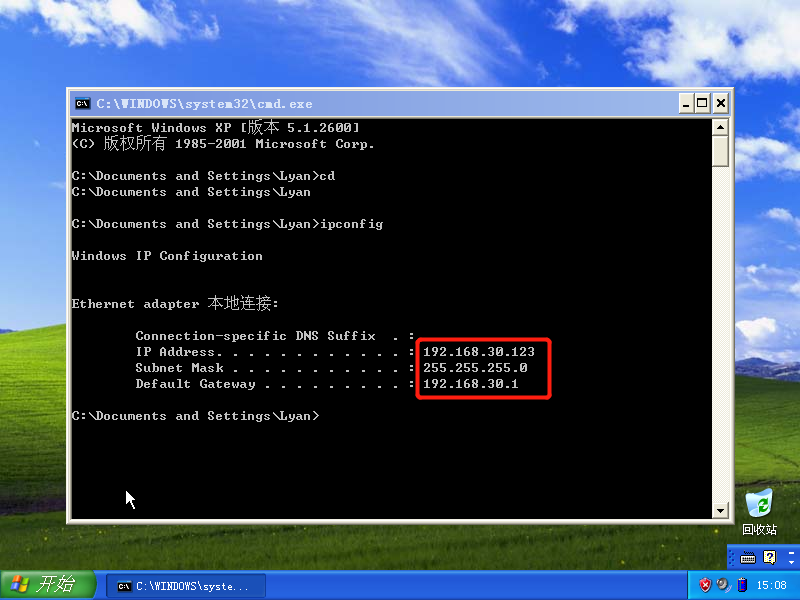
+ 攻击者主机       
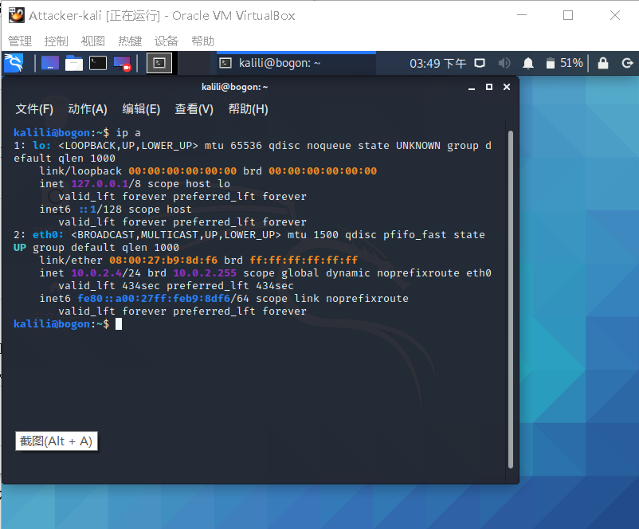

### 实验结果
+ 虚拟硬盘配置成多重加载
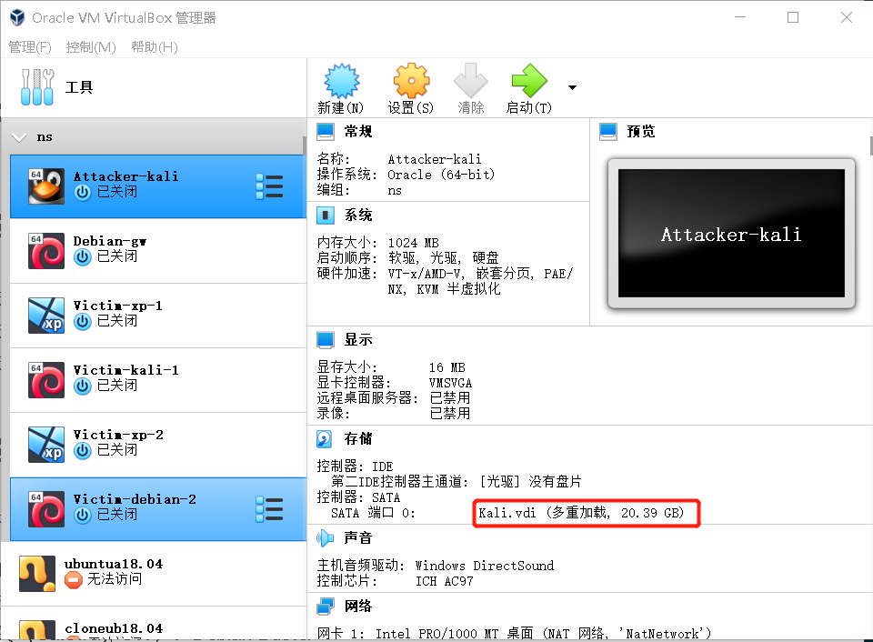
+ 搭建满足要求的虚拟机网络拓扑

  |  虚拟机   | 网卡及ip地址  |
  |  ----  | ----  |
  | 攻击者主机  |  NAT网络（10.0.2.4）|
  |网关  |NAT网络（10.0.2.15），Host-only网络（192.168.203.4），内部网络Intnet1（192.168.20.1），内部网络Intnet2（192.168.30.1）  |
  | 靶机-xp-1 | 内部网络Intnet1（192.168.20.137） |
  | 靶机-kali-1  | 内部网络Intnet1（192.168.20.123） |
  | 靶机-xp-2 | 内部网络Intnet2（192.168.30.123） |
  | 靶机-debian-2  | 内部网络Intnet2（192.168.30.125） |
+ 网络连通性测试
	+  靶机可以直接访问攻击者主机
	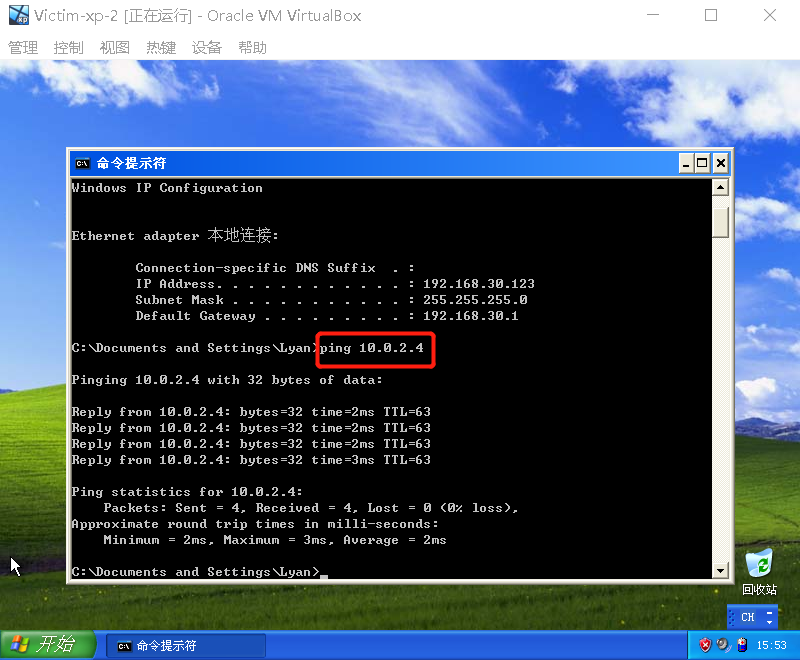
	+ 攻击者主机无法直接访问靶机
	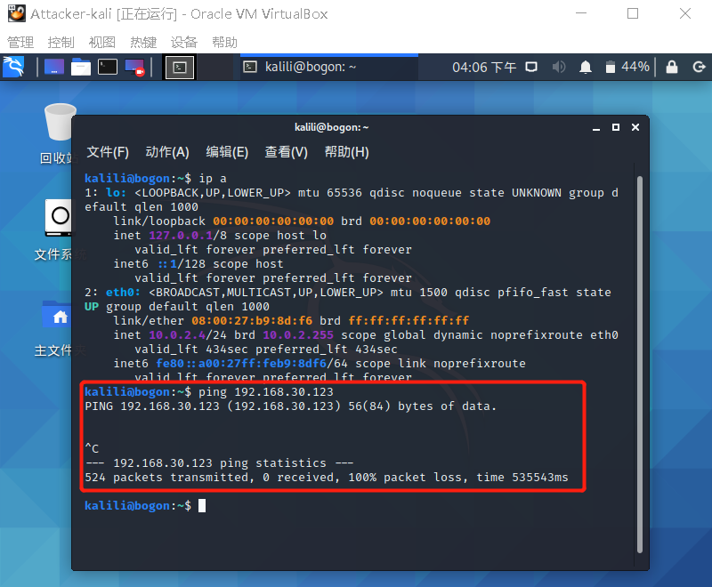
	+ 网关可以直接访问攻击者主机和靶机
		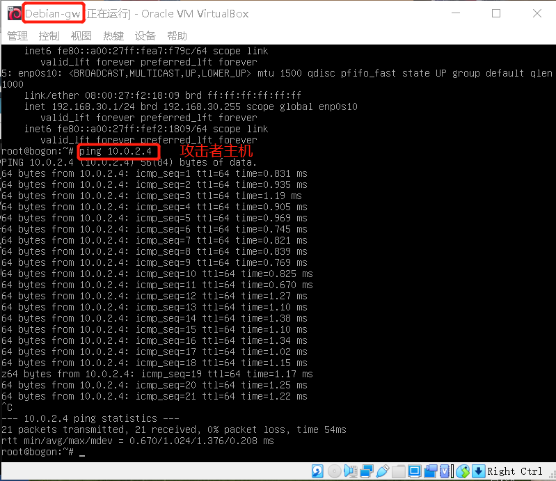
        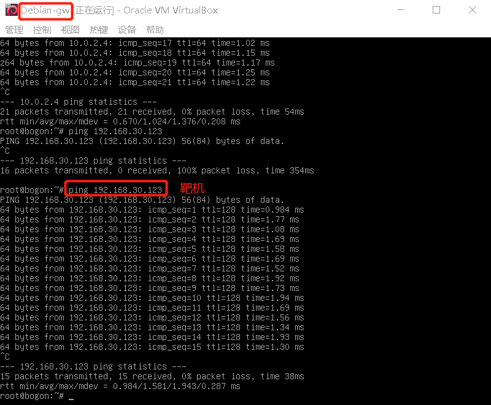
	+ 靶机的所有对外上下行流量必须经过网关           
	靶机访问互联网后，查看网关上的dnsmasq日志
   	 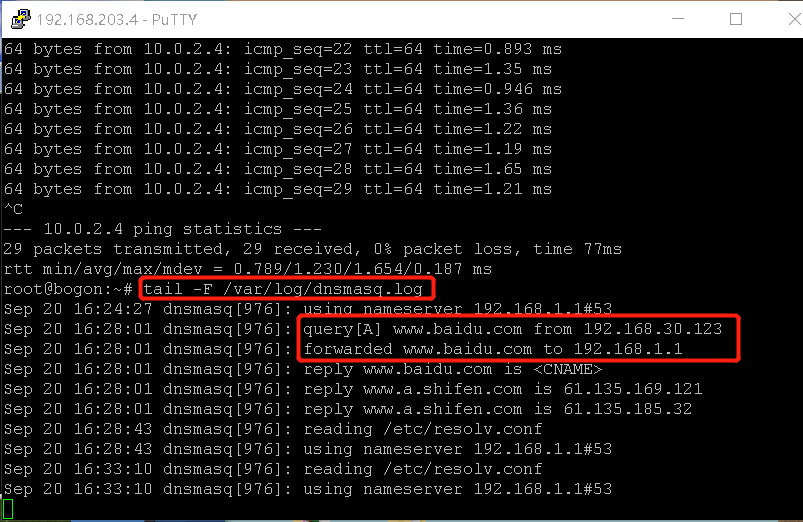
	+ 所有节点均可以访问互联网         
	   网关机      
	   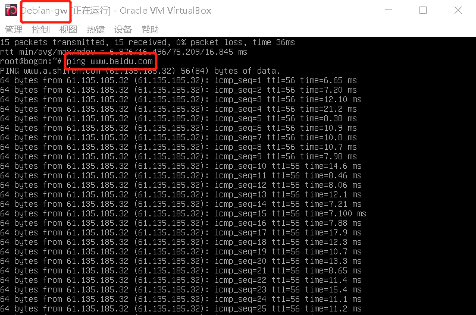       
	   靶机       
	    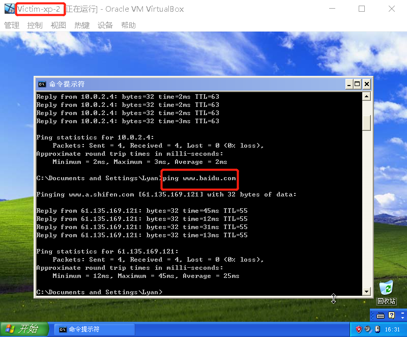     
	    攻击者主机     
	    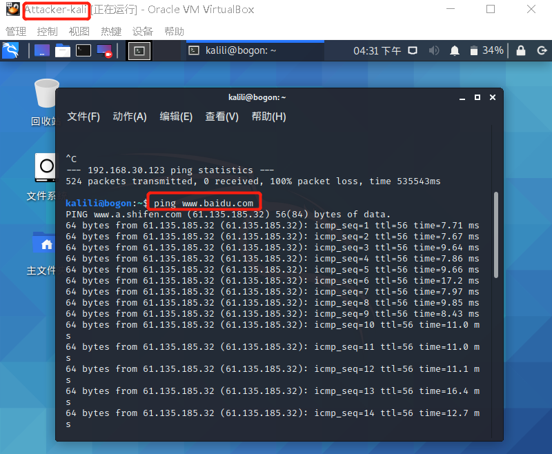

### 实验问题
+ 安装Debian的服务器系统时一直在软件安装这一步出错（忘记截图了...），原因：安装开始时选择了图形界面安装，但选择安装软件时未勾选图形化界面。
解决方法：开始安装时无需选择图形化界面安装

+ 网关机无法ping通window靶机
解决方法：在window机中关闭防火墙

### 实验参考
+ [dnsmasq实现DHCP服务](https://www.jianshu.com/p/9673f4c02773)
+ [课程视频](https://b23.tv/SaslYE)
