# 第九章——入侵检测

## 实验目的
使用Snort进行入侵检测

## 实验环境

- VirtualBox
- Kali 
- debian

## 实验准备

+ 网络拓扑结构

  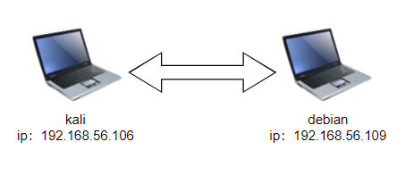

+ Snort安装（debian主机）

  ```
  # 禁止在apt安装时弹出交互式配置界面
  export DEBIAN_FRONTEND=noninteractive
  
  # 下载snort
  apt install snort
  ```

  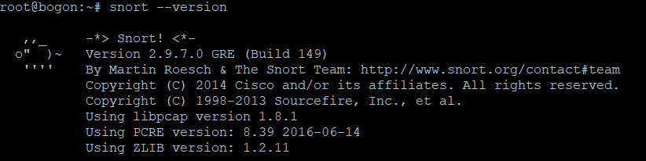

+ Guardian下载（debian主机）

  ```
  # 下载 Guardian-1.7.tar.gz 
  curl -o guardian.tar.gz https://c4pr1c3.github.io/cucns/chap0x09/attach/guardian.tar.gz
  
  # 解压缩 Guardian-1.7.tar.gz
  tar zxf guardian.tar.gz
  
  # 安装 Guardian 的依赖 lib
  apt install libperl4-corelibs-perl
  ```

  

## 实验内容

#### 实验一：配置snort为嗅探模式

+ 显示IP/TCP/UDP/ICMP头 `snor -v`

  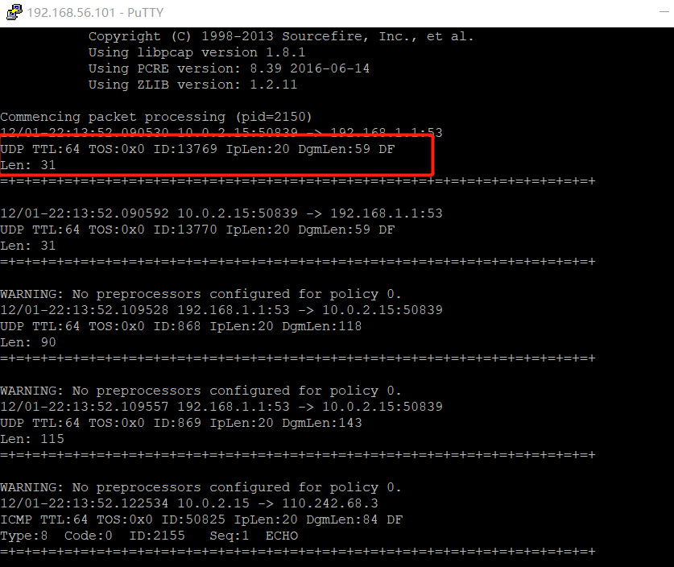

+ 显示应用层数据 `snort -vd`

  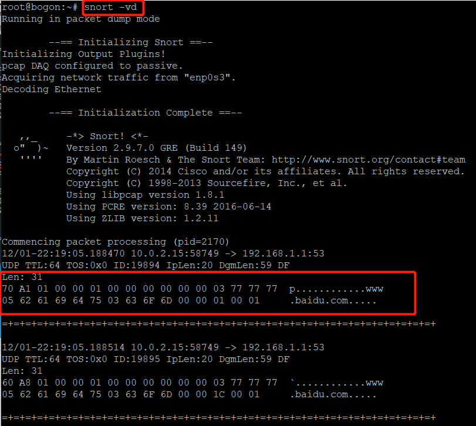

+ 显示数据链路层报文头 `snort -vde`

  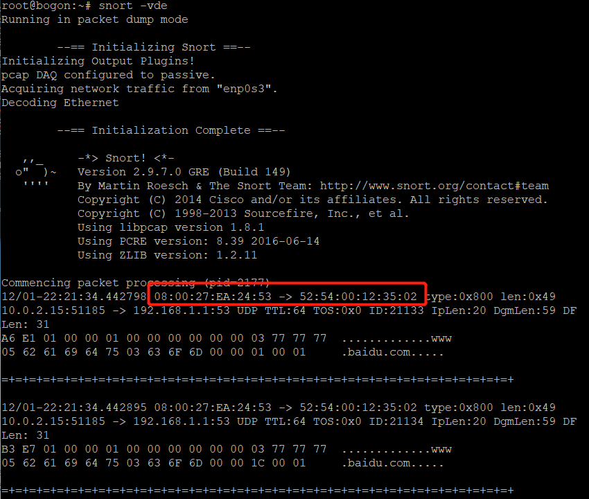

+ ```
  # -b 参数表示报文存储格式为 tcpdump 格式文件
  # -q 静默操作，不显示版本欢迎信息和初始化信息
  snort -q -v -b -i eth1 "port not 22"
  ```

  查看日志信息

  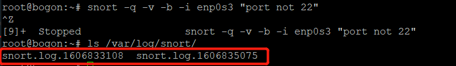


#### 实验二：配置并启用snort内置规则

```
# 将/etc/snort/snort.conf 中的 HOME_NET 和 EXTERNAL_NET 设置为any
# 启用规则
snort -q -A console -b -i eth1 -c /etc/snort/snort.conf -l /var/log/snort/
```

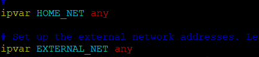


#### 实验三：自定义snort规则

在靶机上进行自定义snort规则配置，对匹配到规则的操作发出警报


+ 配置规则

  ```
  # 新建自定义 snort 规则文件
  cat << EOF > /etc/snort/rules/cnss.rules
  alert tcp \$EXTERNAL_NET any -> \$HTTP_SERVERS 80 (msg:"Access Violation has been detected on /etc/passwd ";flags: A+; content:"/etc/passwd"; nocase;sid:1000001; rev:1;)
  alert tcp \$EXTERNAL_NET any -> \$HTTP_SERVERS 80 (msg:"Possible too many connections toward my http server"; threshold:type threshold, track by_src, count 100, seconds 2; classtype:attempted-dos; sid:1000002; rev:1;)
  EOF
  ```

  ```
  # 添加配置代码到 /etc/snort/snort.conf
  include $RULE_PATH/cnss.rules
  ```

+ 验证规则添加成功

  第一条实现对/etc/passwd文件的监视，对包含特征码(/etc/passwd)的HTTP请求进行检测；第二条是实现对http连接请求条数的限制（这两条规则是自己猜想的，不知道对不对......），在这里对第二条规则进行验证

  + 在靶机开一个webserver，这里选择apache服务

    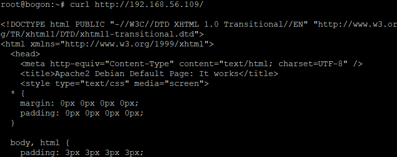

  + 在攻击者主机中使用webbench对靶机进行服务器压力测试

    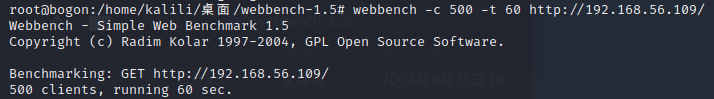

  + 查看靶机的snort日志，可以看到alert文件，查看其内容，可以看到有警报，说明我们规则添加成功了

    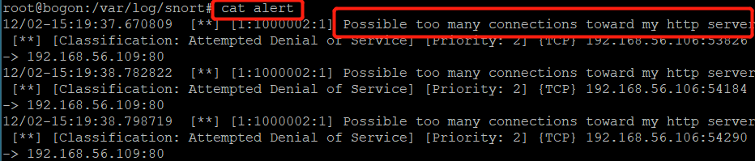

    

#### 实验四：和防火墙联动

在靶机——debian机上运行、配置snort和Guardian
+ 编辑 `guardian.conf` 并保存，确认以下2个参数的配置符合主机的实际环境参数

  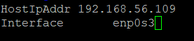

+ 开启snort `snort -q -A fast -b -i eth1 -c /etc/snort/snort.conf -l /var/log/snort/`

+ 开启Guardian `perl guardian.pl -c guardian.conf`

  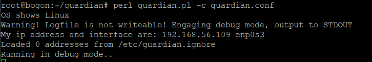

 + 在攻击者主机上nmap暴力扫描靶机
	
    + Guardian的状态更新
   	
      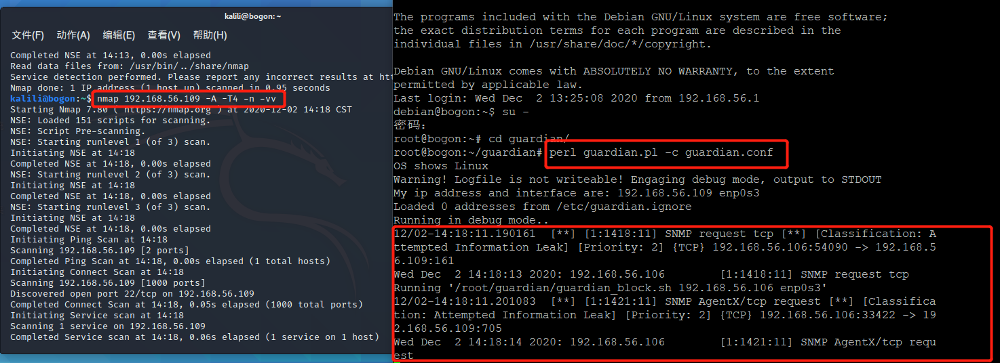
   
   + 防火墙状态
   
     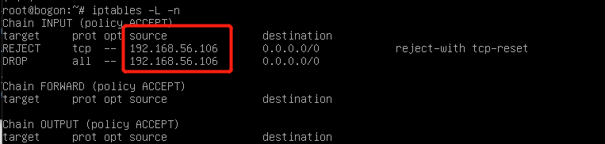
   
   + 一分钟后防火墙删除记录
   
     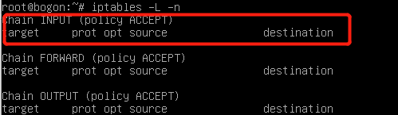


## 实验问题

+ 使用语句 `snort -q -v -b -i eth1 "port not 22"`保存嗅探内容的时候报错

  ```
  ERROR: Can't start DAQ (-1) - SIOCGIFHWADDR: No such device!
  Fatal Error, Quitting..
  ```

  解决办法：查看snort开头给出的信息里，其监听的网卡是enp0s3，因此把语句中的eth1改成对应网卡即可

  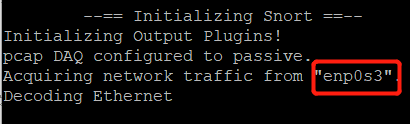

+ 验证snort自定义规则时，未查看到报警信息

  解决：snort是基于日志的报警，报警信息不会直接在命令行显示，应该在日志内查找


## 实验参考

+ [webbench安装与使用](https://blog.csdn.net/pamelay/article/details/77401374)

+ [课本](https://c4pr1c3.gitee.io/cuc-ns/chap0x09/exp.html)

  
