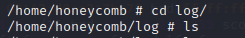
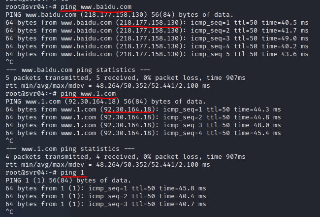
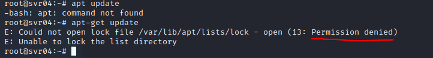

# 常见蜜罐体验和探索

## 实验目的

- 了解蜜罐的分类和基本原理

- 了解不同类型蜜罐的适用场合

- 掌握常见蜜罐的搭建和使用

  

## 实验环境

- VirtualBox
- 低交互蜜罐：ssh-honeypot
- 中等交互蜜罐：cowire

  

## 实验内容

### ssh-honeypot

**蜜罐搭建**

+ 更改原有ssh服务端口号
  由于本机ssh服务和要安装的docker都使用的是22端口，有端口冲突，因此需要先修改一下本机ssh服务端口号,这里改成9999（之后别忘了改回来...

  + `vi /etc/ssh/sshd_config`

      

  + 重启ssh服务 `systemctl restart sshd`

+ 安装docker镜像

  ```
  git clone https://github.com/droberson/ssh-honeypot
  cd ssh-honeypot/docker
  docker-compose build
  
  
  ```

+ 启动容器

  `docker-compose -p ssh-honeypot up`

+ 进入容器

  + `docker ps` 查看容器ID

    

  + docker exec -it container_id /bin/sh

    

**蜜罐测试**

+ 查看日志
  根据github上给出的信息，该蜜罐内日志文件变量的地址为/home/honeycomb/log，我们先查看一下原始的日志内容。由于此时攻击者并没有任何行为，所以还没有日志信息（empty）

  

+ ssh连接

  + Attacker: 在Attacker上对Victim进行ssh连接`ssh kalili@192.168.56.105 -p 22`

  + Victim: 此时查看蜜罐中的log会发现有日志信息更新，可以看到日志中记录了攻击事件、攻击时间、攻击者ip、ssh时输入的用户名密码等信息

    

  + 同时在Attacker上发现无论输入什么密码都无法连接成功，说明该蜜罐只是一个低交互的蜜罐，只能开放简单服务和端口，无法提供进一步的交互动作

+ nmap

  + Attacker: 在Attacker上进行nmap扫描`nmap 192.168.56.105`

    

  + Victim: 这时在蜜罐日志中并没有看到信息，说明该ssh蜜罐只会记录与ssh相关的行为

    


### cowrie

**蜜罐搭建**

+ 安装docker镜像

```
git clone https://github.com/cowrie/docker-cowrie
cd docker-cowrie
make all
```

+ 启动容器

  `docker run -p 2222:2222 cowrie/cowrie`

**蜜罐测试**

+ ssh连接

  + Attacker: 在Attacker上对Victim进行ssh连接`ssh -p 2222 root@localhost`，此时任意输入一个密码都可以成功连接

    

    但是一会后连接会自动断开

    

    然后再次随意输入一个密码也能连接成功，但一段时间后又会自动断开

  + Victim: 在蜜罐中可以查看到Attacker的攻击信息

    

  

+ 命令语句

  + Attacker： 在Attacker中以root身份ssh连接上蜜罐以后，可以输入命令模拟攻击

    + ping一些网站名发现不管ping什么都能ping通

      

      我们在本机中ping以上网站，对比结果可以猜测蜜罐中ping的结果都是随意设置的

      

    + 执行apt-get命令时显示permission denied，但此时登陆的明明是root用户，这里蜜罐就露馅了

      

  + Victim: Victim的蜜罐中可以看到来自攻击者主机的各种命令记录

    

+ nmap扫描

  + Attacker: 		

    

  + Victim: 容器中也没有nmap记录

    


## 实验总结

#### 蜜罐识别和检测方法

+ 本次实验
  + 在对低交互蜜罐ssh-honeypot的测试中，由于该蜜罐的交互程度很低因此在Attacker进行ssh过程中好像并没有多少破绽露出？因为只有一个输入密码的过程，该蜜罐可以获取攻击者进行密码爆破时使用的字典，但无法记录更多的攻击行为
  + Cowrie蜜罐体验起来就能感觉到交互程度要比ssh-honeypot高很多，首先攻击者进行ssh可以连接成功，并且能进一步执行很多命令，但是在执行命令时可以发现很多异常行为然后识别出蜜罐，例如上述的ping、apt命令。（感觉蜜罐如果建的不完善的话，就是“谎言只会越说越多,而更多的谎言只会让破绽越多”...
+ 总结常见的蜜罐识别和检测方法
  + 这篇文章里总结的很完善啦:[如何判断是不是进入了蜜罐](https://www.zhihu.com/question/31213254/answer/137153019)

#### 实验问题

+ 在开启ssh-honeypot时报错22端口已经被占用

  

  解决：由于本机ssh服务和要安装的docker都使用的是22端口，有端口冲突，因此需要先修改一下本机ssh服务端口号

+ 使用命令`docker exec -i -t id bash`进入容器时报错`starting container process caused "exec: \"bash\": executable file not found in $PATH": unknown`

  解决：将bash加入环境变量或是在命令中将bash改为`docker exec -i -t id /bin/sh`


## 实验参考


+ [ssh-honeypot](https://github.com/droberson/ssh-honeypot)
+ [cowrie蜜罐](https://github.com/cowrie/docker-cowrie)

+ [在服务器上搭建简易的ssh蜜罐](https://blog.csdn.net/star92014/article/details/89260094)
+ [如何判断是不是进入了蜜罐](https://www.zhihu.com/question/31213254/answer/137153019)

+ [报错：starting container process caused “exec: \”bash\“: executable file not found in $PATH”: unknown](https://stackoverflow.com/questions/63937096/starting-container-process-caused-exec-bash-executable-file-not-found-in)

