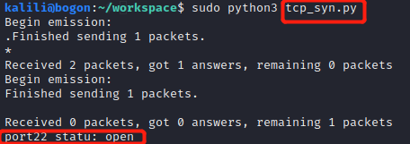
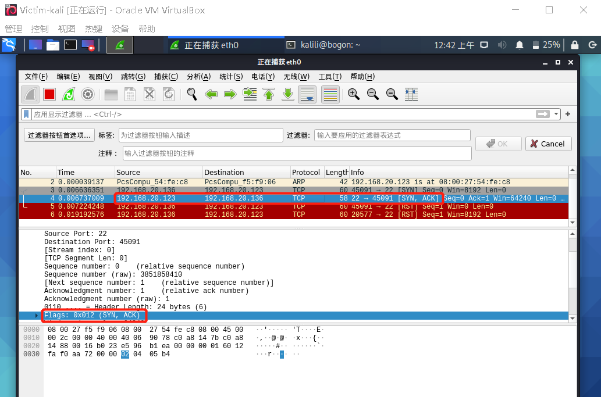

# 实验五——基于 Scapy 编写端口扫描器
## 实验目的
掌握网络扫描之端口状态探测的基本原理
## 实验环境
+ Virtual box + Kali
+ 网络拓扑结构（三台虚拟机在同一内网内）      

+ python + scapy

## 实验要求
  + [x] 禁止探测互联网上的 IP ，严格遵守网络安全相关法律法规
+ [x] 完成以下扫描技术的编程实现
	+ TCP connect scan,TCP stealth scan
	+ TCP Xmas scan 
	+ UDP scan

+ [x] 上述每种扫描技术的实现测试均需要测试端口状态为：开放、关闭 和 过滤 状态时的程序执行结果
+ [x] 提供每一次扫描测试的抓包结果并分析与课本中的扫描方法原理是否相符？如果不同，试分析原因；
+ [x] 在实验报告中详细说明实验网络环境拓扑、被测试 IP 的端口状态是如何模拟的

## 实验过程
+ TCP测试端口：22
  + 端口开启：开启ssh服务`systemctl start ssh`
  + 端口过滤状态：添加规则`iptables -A INPUT -p tcp --dport 80 -j DROP`
  + 22端口各状态下nmap扫描结果
    + closed
		
	+ open
		
	+ filtered
  		 

+ UDP测试端口：53/udp
  + 端口开启：开启dnsmasq服务`systemctl start dnsmasq`
  + 端口过滤状态：添加规则`iptables -A INPUT -p udp --dport 53 -j DROP`
  + 53端口各状态下nmap扫描结果
    + closed
		
	+ open
		
	+ filtered
  		 

## 实验结果
### TCP connect scan
+ 原理       
  基于最基本的 TCP 三次握手链接建立机制，攻击主机发送一个 SYN 数据包到目标主机的特定端口上，端口各状态下接受包的情况为：
  + 端口关闭：目标主机返回一个RST/ACK数据包，说明端口处于关闭状态
  + 端口开启：目标机接受该次连接并返回一个带有 SYN/ACK 标识的数据包给攻击端，随后攻击端返回一个 ACK 确认包，此时两端建立了连接，完成了一次三次握手，那么目标端对应的端口就是开放的
  + 端口过滤状态：目标主机没有任何响应则意味着目标主机的端口处于过滤状态
+ [代码](script/tcp_connect.py)
+ 实验结果：端口各状态下代码运行结果和抓包情况
  + 端口开启状态
	
	目标机返回SYN/ACK数据包，攻击端发送ACK确认包
	
  + 端口关闭状态
	
	目标机返回RST/ACK数据包
	  
  + 端口过滤状态
	
	目标机无任何响应
	

### TCP stealth/SYN scan
+ 原理     
  TCP SYN 扫描并不需要打开一个完整的链接。发送一个 SYN 包启动三方握手链接机制，并等待响应，端口各状态下接受包的情况为：
  + 端口关闭：目标主机返回一个RST/ACK数据包，说明端口处于关闭状态
  + 端口开启：目标机接收到一个 SYN/ACK 包表示目标端口是开放的，此时与TCP connect扫描不同，攻击端发送一个 RST 包立即拆除连接
  + 端口过滤状态：目标主机没有任何响应则意味着目标主机的端口处于过滤状态
+ [代码](script/tcp_syn.py)
+ 实验结果：端口各状态下代码运行结果和抓包情况
  + 端口开启状态
	
	目标机返回SYN/ACK数据包，攻击端发送RST 包拆除连接
	
  + 端口关闭状态
	
	目标机返回RST/ACK数据包
	  
  + 端口过滤状态
	
	目标机无任何响应
	

### TCP Xmas scan
+ 原理     
  攻击端发送一个 TCP 包，并对 TCP 报文头 FIN、URG 和 PUSH 标记进行设置，端口各状态下接受包的情况为：
  + 端口关闭：目标机响应 RST 报文，则表示端口为关闭状态
  + 端口开启或过滤状态：目标主机没有任何响应
+ [代码](script/tcp_Xmas.py)
+ 实验结果：端口各状态下代码运行结果和抓包情况
  + 端口开启或过滤状态
	
	目标机无任何响应
	
  + 端口关闭状态
	
	目标机返回RST/ACK数据包
	  
  
### UDP scan  
+ 原理     
  UDP 是一个无链接的协议，攻击端向目标主机的 UDP 端口发送零字节的 UDP 数据包
  端口各状态下接受包的情况为：
  + 端口关闭：目标机返回一个 ICMP 不可到达(ICMP_PORT_UNREACHABLE)的错误，说明端口处于关闭状态
  + 端口开启或过滤状态：目标主机没有任何响应
+ [代码](script/udp.py)
+ 实验结果：端口各状态下代码运行结果和抓包情况
  + 端口开启或过滤状态
	
	目标机无任何响应
	
  + 端口关闭状态
	
	目标机返回ICMP 不可到达(ICMP_PORT_UNREACHABLE)的数据包
	 

## 实验问题
+ python使用问题：import scapy库报错，解决方法：主机内Scapy是用`pip3 install scapy[complete]`下载的，依赖于python3，但主机python的默认版本是python2.所以使用python3或修改一下默认的python版本就好
+ UDP端口状态问题：在目标机上尝试开启了很多种UDP服务，但是在攻击端主机上`nmap Victim_ip`始终只有开启的TCP端口信息，以为UDP端口开启不了，但后来发现需要`nmap Victim_ip -sU`才能看到UDP端口的信息
师姐解释：nmap扫描默认发送tcp的数据包

## 实验参考
+ https://github.com/CUCCS/2019-NS-Public-CooolKey/tree/NS-0x05/NS-0x05
+ [Linux设置默认Python版本](https://blog.csdn.net/Romance5201314/article/details/81667778)
+ [如何用Scapy写一个端口扫描器？](https://blog.csdn.net/think_ycx/article/details/50898096)
+ [课本](https://c4pr1c3.gitee.io/cuc-ns/chap0x05/main.html)
+ [nmap命令-----基础用法](https://www.cnblogs.com/nmap/p/6232207.html)